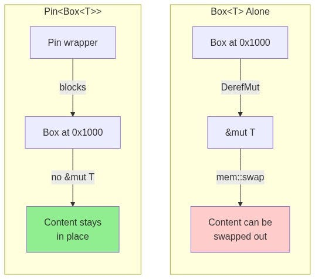

## The Exhaustive Version

I recently wrote a comprehensive exploration of pinning that covered self-referential structs, move semantics, async state machines, and all the edge cases where pinning matters. That post runs long. It covers the territory thoroughly. But somewhere around the third diagram, a simpler truth emerged.

### Pinning distills to three observations:

1. Self-Referential Structs Need Heap Allocation
A struct that contains a pointer to its own data cannot live on the stack. Move the stack frame and the internal pointer dangles. The solution is heap allocation: the struct lives at a stable address that survives scope transitions and function calls. This is not controversial. Any language with move semantics faces the same constraint.

2. Box Provides Heap Allocation But Leaks Mutability
Box<T> gives you heap allocation. The struct lives at a fixed address. Problem solved? Not quite. Box implements DerefMut, which hands out &mut T to anyone who asks. A mutable reference is permission to relocate. Call mem::swap on that reference and the heap address stays the same while the content changes completely. Any self-referential pointers now reference the wrong data.

 

None
The heap address is stable. The content at that address is not.

3. Pin Removes DerefMut
Pin<T> wraps the pointer and withholds DerefMut from types that have not implemented Unpin. No &mut T means no mem::swap, no mem::replace, no accidental relocation. The content at the heap address is locked in place by the type system.

That is the entire mechanism. Self-referential structs need stable addresses. Box provides the address but exposes mutability. Pin closes the mutability hole.

### The Scaffolding
Rust adds some additional machinery because Unpin is an auto-trait. Types that contain no self-references implement Unpin automatically, and Pin becomes a transparent wrapper with no restrictions. Types that need pinning must opt out by including PhantomPinned. The distinction lets most code ignore pinning entirely while the types that need it get the guarantees they require.

The async runtime pins futures before polling. The futures build self-references during execution. Those references remain valid because Pin prevents relocation. When the future completes, it drops in place. The entire async/await system rests on this guarantee.

### Three Lines
- Self-referential structs require heap allocation.
- Box<T> allocates on the heap but implements DerefMut.
- Pin<T> removes DerefMut for non-Unpin types.
